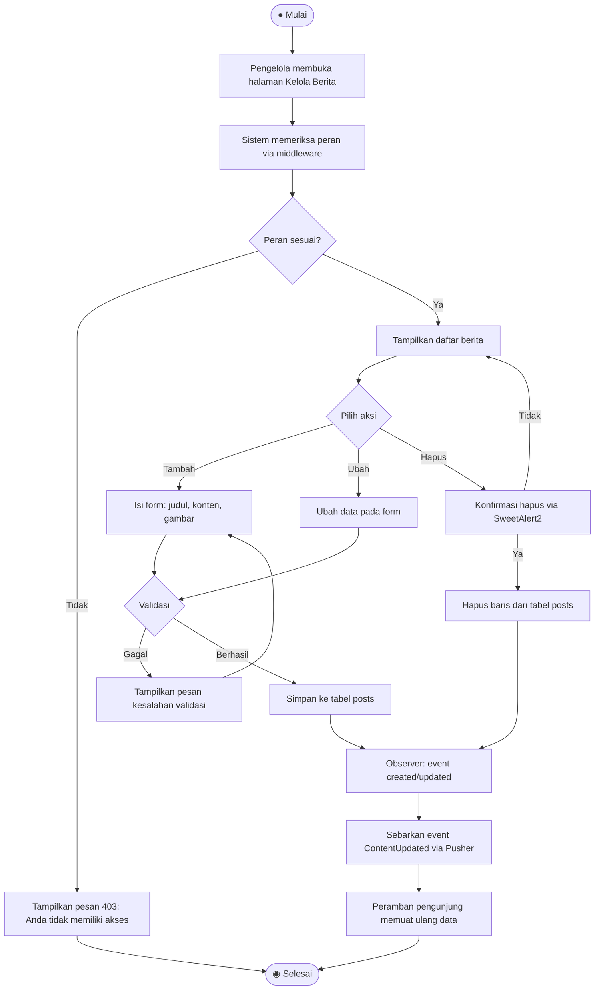
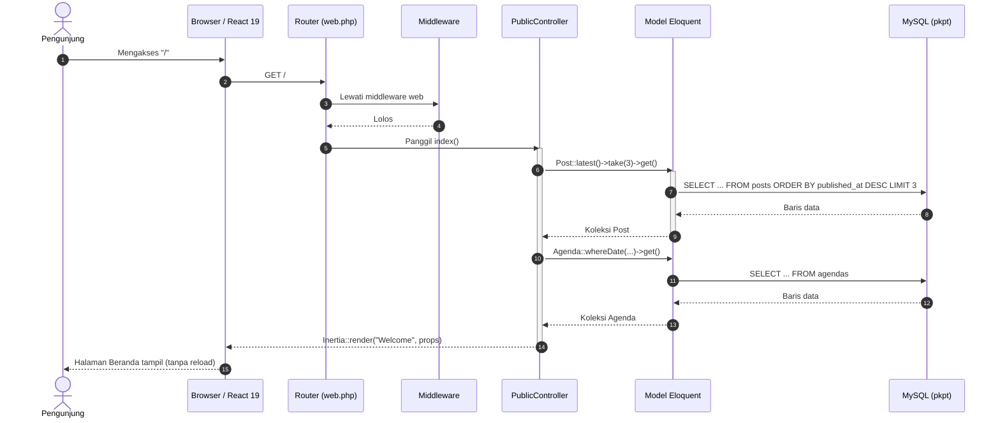
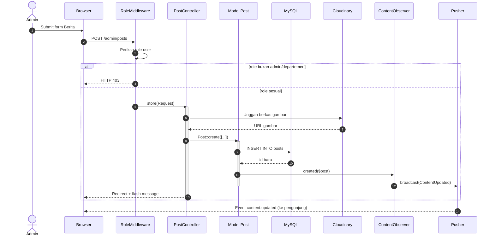
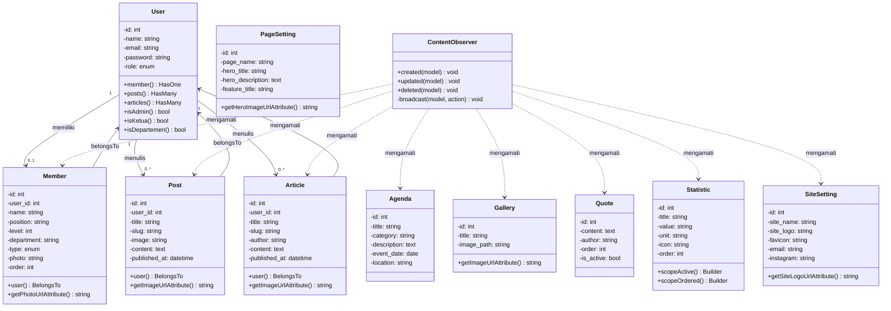
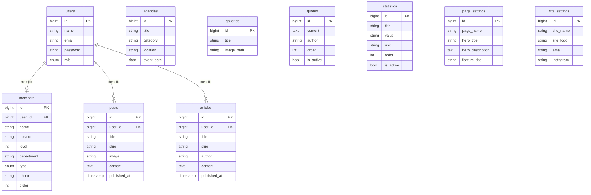

# Analisis & Perbaikan Bagian UML

Dokumen pendamping untuk menyusun/ memperbaiki bagian UML pada laporan KP. Berisi: (1) diagnosis kesalahan yang lazim terjadi, (2) rancangan UML yang benar untuk sistem PKPT IPNU-IPPNU UNEJ, (3) aturan penempatan di laporan.

Semua rancangan di bawah disusun dari pembacaan langsung `routes/web.php`, `app/Models`, `app/Http/Controllers`, dan `database/migrations`.

---

## 1. Diagnosis: mengapa bagian UML sering dianggap salah

### 1.1 Kesalahan konseptual (paling fatal)

| # | Kesalahan | Kenapa salah | Perbaikan |
|---|---|---|---|
| 1 | **ERD disebut *class diagram*** | ERD memodelkan **tabel** (ada PK/FK, tanpa metode) dan **bukan diagram UML**. *Class diagram* memodelkan **kelas** (ada atribut + metode + visibilitas) | Tulis dua sub-bab terpisah: "Perancangan Basis Data (ERD)" dan "Class Diagram" |
| 2 | **Diagram diletakkan di Bab 2** | Bab 2 = landasan teori. Diagram adalah **hasil perancangan** | Teori UML → Bab 2. Diagram sistem → Bab 3 |
| 3 | **Aktor = nama orang** ("Fajar", "Admin Budi") | Aktor adalah **peran**, bukan individu | Gunakan "Admin", "Ketua", "Departemen", "Pengunjung" |
| 4 | *Use case* berupa **kata benda** ("Berita", "Agenda") | *Use case* adalah **fungsi/layanan**, harus diawali kata kerja | "Melihat Berita", "Kelola Berita" |
| 5 | **CRUD dipecah jadi 4 *use case*** (Tambah Berita, Edit Berita, Hapus Berita, Lihat Berita) | Membuat *use case diagram* menjadi daftar menu, bukan model kebutuhan | Satu *use case* "Kelola Berita"; rincian Create/Read/Update/Delete ditulis di *use case scenario* (tabel skenario) |
| 6 | **Arah `<<include>>` / `<<extend>>` terbalik** | Keduanya bergaris putus-putus berpanah dan sering tertukar | `<<include>>`: panah **dari** induk **ke** yang disertakan (wajib). `<<extend>>`: panah **dari** tambahan **ke** induk (opsional) |

### 1.2 Kesalahan notasi teknis

| # | Kesalahan | Perbaikan |
|---|---|---|
| 7 | *Activity diagram* tanpa *initial node* / *final node* | Wajib ada: satu ● di awal, minimal satu ◉ di akhir |
| 8 | Percabangan (◇) tanpa keterangan kondisi di salah satu jalur | Tulis kondisi di atas garis, mis. `[valid]` / `[tidak valid]` |
| 9 | *Sequence diagram* tanpa *activation bar* | Tambahkan persegi panjang sempit di atas *lifeline* saat objek aktif |
| 10 | *Return message* digambar dengan **garis lurus** | *Return* harus **garis putus-putus** + panah terbuka |
| 11 | *Class diagram* tanpa multiplisitas | Tulis `1`, `1..*`, `0..*` di kedua ujung relasi |
| 12 | *Class diagram* dibuat untuk **setiap tabel** | Buat untuk kelas yang memiliki **perilaku**; tabel murni cukup di ERD |

---

## 2. Rancangan UML yang benar untuk sistem ini

### 2.1 *Use Case Diagram*

**Aktor (4):**
| Aktor | Keterangan |
|---|---|
| Pengunjung | Publik, tanpa login — mengakses 10 halaman informasi |
| Admin | Mengelola seluruh modul + pengguna + pengaturan |
| Ketua | Mengelola agenda, galeri, anggota, statistik |
| Departemen | Mengelola berita, artikel, kutipan |

**Saran pemodelan:** gunakan **generalisasi**. Buat aktor abstrak **"Pengelola"** yang mewarisi *Login*, *Melihat Dashboard*, dan *Kelola Profil Sendiri*; lalu `Admin`, `Ketua`, `Departemen` menjadi aktor turunan. Ini jauh lebih rapi daripada menggambar 3 aktor dengan *use case* yang sama berulang-ulang.

```mermaid
usecaseDiagram
left to right direction

actor "Pengunjung" as P
actor "Pengelola (abstrak)" as G
actor "Admin" as A
actor "Ketua" as K
actor "Departemen" as D

G <|-- A
G <|-- K
G <|-- D

rectangle "Situs Web PKPT IPNU-IPPNU UNEJ" {
  P -- (Melihat Beranda)
  P -- (Melihat Berita)
  P -- (Melihat Artikel)
  P -- (Melihat Galeri)
  P -- (Melihat Agenda)
  P -- (Melihat Profil: sejarah, visi-misi, struktur)

  (Melihat Beranda) .> (Memuat Ulang Konten Realtime) : <<extend>>

  G -- (Login)
  G -- (Melihat Dashboard)
  G -- (Kelola Profil Sendiri)

  A -- (Kelola Pengguna)
  A -- (Kelola Pengaturan Situs)
  A -- (Kelola Pengaturan Halaman)

  K -- (Kelola Agenda)
  K -- (Kelola Galeri)
  K -- (Kelola Anggota)
  K -- (Kelola Statistik)

  D -- (Kelola Berita)
  D -- (Kelola Artikel)
  D -- (Kelola Kutipan)

  (Kelola Pengguna) ..> (Autentikasi) : <<include>>
  (Kelola Pengaturan Situs) ..> (Autentikasi) : <<include>>
  (Kelola Pengaturan Halaman) ..> (Autentikasi) : <<include>>
  (Kelola Agenda) ..> (Autentikasi) : <<include>>
  (Kelola Galeri) ..> (Autentikasi) : <<include>>
  (Kelola Anggota) ..> (Autentikasi) : <<include>>
  (Kelola Statistik) ..> (Autentikasi) : <<include>>
  (Kelola Berita) ..> (Autentikasi) : <<include>>
  (Kelola Artikel) ..> (Autentikasi) : <<include>>
  (Kelola Kutipan) ..> (Autentikasi) : <<include>>
  (Kelola Berita) ..> (Unggah Gambar ke Cloudinary) : <<include>>
  (Kelola Galeri) ..> (Unggah Gambar ke Cloudinary) : <<include>>
}
```

**Catatan penulisan di laporan:**
- Gunakan **`<<include>>` hanya untuk hal yang benar-benar selalu terjadi** (autentikasi, unggah gambar).
- Gunakan **`<<extend>>` untuk perilaku bersyarat** (pembaruan realtime hanya terjadi bila ada *event* masuk).
- Jangan membuat `<<include>>` dari *Login* ke *Autentikasi* — *Login* **adalah** proses autentikasi, jadi cukup ditulis sebagai satu *use case*.

### 2.2 *Activity Diagram* — contoh: "Kelola Berita"



**Yang perlu diperhatikan:**
- Ada satu ● di awal dan satu ◉ di akhir.
- Setiap percabangan (◇) memiliki keterangan kondisi pada garisnya.
- Alur berakhir juga pada cabang "tidak punya akses" — bukan hanya pada cabang sukses.

### 2.3 *Sequence Diagram* — contoh: "Pengunjung membuka halaman Beranda"



**Yang perlu diperhatikan:**
- Panah `->>` = *synchronous message* (garis lurus, panah penuh).
- Panah `-->>` = *return message* (garis putus-putus, panah terbuka).
- `activate` / `deactivate` menghasilkan *activation bar*.
- Objek diurutkan kiri → kanan sesuai urutan keterlibatan.

**Variasi untuk alur admin (tambahan objek):**



### 2.4 *Class Diagram*

**Penting:** ini *class diagram* perangkat lunak, **bukan** skema tabel.



**Catatan:**
- Baris ketiga pada setiap kotak berisi **metode** — inilah pembeda utama dari ERD (`getImageUrlAttribute()`, `scopeActive()`, `isAdmin()`).
- `ContentObserver` menggunakan **dependency** (garis putus-putus), karena ia tidak menyimpan referensi permanen ke model.
- Multiplisitas ditulis di kedua ujung: `1` — `0..*`, dst.

### 2.5 ERD (terpisah dari *class diagram*)



Sub-bab ini ditulis dengan judul **"Perancangan Basis Data (ERD)"**, diletakkan **terpisah** dari sub-bab *class diagram*.

---

## 3. Penempatan di dalam laporan

Menurut **Buku Panduan KP Teknik Informatika UNSIQ**, sistematika bagian isi adalah:

| Bab | Isi menurut panduan | Tempat untuk UML |
|---|---|---|
| **BAB I** Pendahuluan | Latar belakang, tujuan, manfaat, batasan, identitas KP, sistematika penulisan | — |
| **BAB II** Landasan Teori | Teori-teori yang berhubungan dengan permasalahan | **Teori UML saja** (pengertian, tabel notasi, aturan `include`/`extend`, perbedaan *class diagram* vs ERD). **Tidak ada gambar diagram** |
| **BAB III** Tinjauan Umum | Gambaran umum instansi, sistem yang sedang berjalan, urutan proses penyelesaian masalah | Boleh memuat *flowchart* sistem berjalan (bukan UML rancangan) |
| **BAB IV** Hasil dan Pembahasan | Analisis sistem berjalan, usulan solusi, **perancangan dan rekayasa sistem** sebagai solusi | **Semua diagram UML**: *use case, activity, sequence, class diagram*, dan ERD |
| **BAB V** Penutup | Kesimpulan dan saran | — |

Jadi seluruh rancangan UML pada bagian 2 dokumen ini diletakkan pada **BAB IV**, sedangkan teori notasinya sudah tersedia di `docs/BAB-2-Landasan-Teori.md`.

---

## 4. Daftar periksa sebelum dikumpulkan

- [ ] Setiap definisi memiliki sitasi, dan sebagian besar terbitan 2022–2026
- [ ] Tidak ada diagram di Bab 2 (kecuali diwajibkan panduan)
- [ ] Aktor ditulis sebagai peran, bukan nama orang
- [ ] *Use case* diawali kata kerja
- [ ] CRUD tidak dipecah menjadi 4 *use case* terpisah
- [ ] Arah `<<include>>` dan `<<extend>>` sudah dicek ulang
- [ ] *Activity diagram* memiliki ● dan ◉
- [ ] *Sequence diagram* memiliki *activation bar* dan *return* bergaris putus-putus
- [ ] *Class diagram* memuat metode dan multiplisitas
- [ ] ERD ditulis di sub-bab tersendiri, tidak dicampur dengan *class diagram*
- [ ] Semua diagram diberi nomor dan judul, misalnya "Gambar 3.1 *Use Case Diagram* Sistem"
- [ ] Setiap diagram diikuti narasi penjelasan minimal satu paragraf
